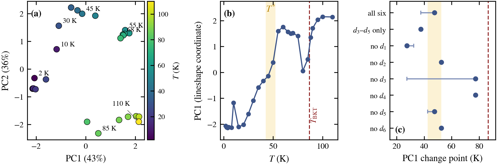
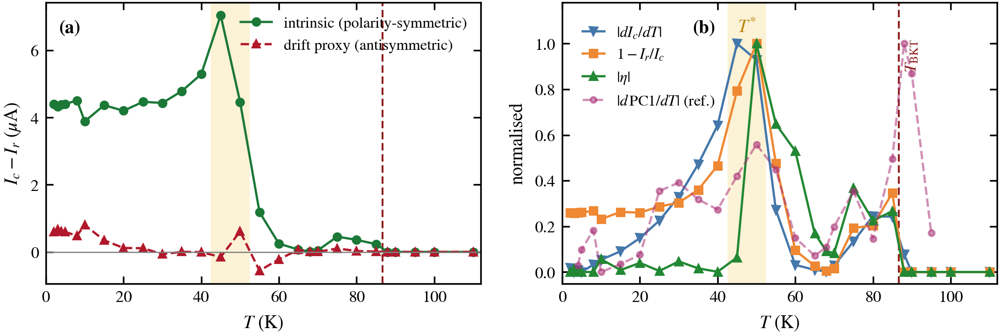
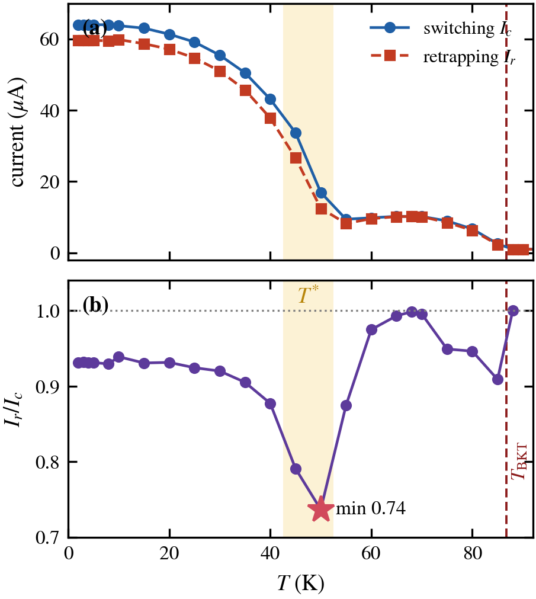
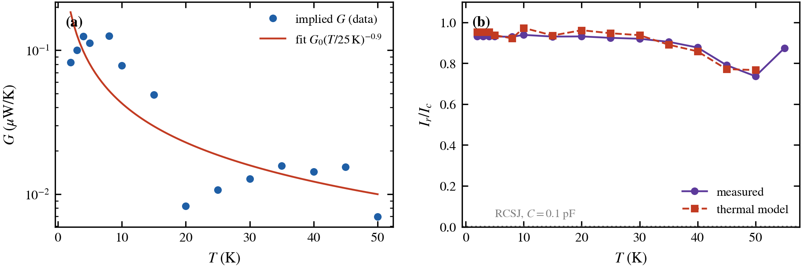
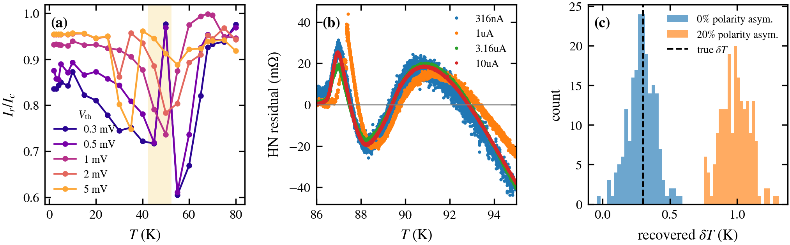

# Automated, threshold-free detection of transitions in a single-device superconducting dataset

**System:** one hBN-encapsulated, exfoliated Bi₂Sr₂CaCu₂O₈₊δ (BSCCO-2212) weak link
· 27 temperatures (2–110 K) · 131 current sweeps (17,946 points) · zero magnetic field

This repository contains a reproducible pipeline that takes a temperature series of
nonlinear current–voltage curves from **one sample** and locates where the system changes
its behaviour. It proposes transition locations from several independently constructed
observables, attaches a bootstrap uncertainty to each, and then **audits** each location
against the analysis choices that could have produced it: voltage thresholds, fit windows,
descriptor sets, and sweep-to-sweep drift. Applied to this dataset, the audit leaves two
characteristic temperatures of different nature:

| | $`T_{\rm BKT}`$ | $`T^*`$ |
|---|---|---|
| **Nature** | thermodynamic phase transition (Berezinskii–Kosterlitz–Thouless, infinite order) | dynamical crossover of the current-driven system (continuous, not a phase transition) |
| **Detected by** | Halperin–Nelson fit of $`R(T)`$ at four bias currents | peaks of three current-based observables: $`\lvert dI_c/dT\rvert`$, hysteresis $`1-I_r/I_c`$, nonreciprocity $`\lvert\eta\rvert`$ |
| **Value** | $`86.7 \pm 0.3`$ K (fit-window systematic) | $`45`$–$`50`$ K, each peak $`\pm 2.5`$ K (temperature-grid limited) |

$`T^*/T_{\rm BKT} \simeq 0.55`$. At $`T^*`$ the hysteresis behaves like the bistable window
of a driven nonlinear system. A threshold-free PCA of the curve shapes shows that the
whole lineshape evolves along a single latent coordinate. The audit also shows that the
*location* of the PCA change point depends on which shape descriptors are used, so we do
not use it as an estimate of $`T^*`$ (details below).

📄 Manuscript: [`main.pdf`](main.pdf) (REVTeX, 8 pages)
· Original group-meeting slides: [`Inspecting Superconducting Property through BSSCO Devices.pdf`](Inspecting%20Superconducting%20Property%20through%20BSSCO%20Devices.pdf)

---

## The problem

A superconducting weak link is a driven nonlinear system. At each temperature $`T`$
(control parameter) we ramp the current $`I`$ (drive) up and down and record the voltage
$`V(I;T)`$ (response). The question is where in $`T`$ the response reorganizes. With this
dataset, three things make that hard:

1. **No natural order parameter.** The obvious candidate, the critical current $`I_c`$,
   is defined by a voltage threshold. A fixed threshold measures *different physical
   features* at different temperatures. At 35 K, for example, a 5 mV threshold lands inside
   a low-voltage plateau and produces a spurious spike in $`I_c(T)`$.
2. **Small $`N`$.** There are 27 temperature nodes with 2–5 repeats each. Asymptotic
   statistics and finite-size scaling are not available.
3. **One device.** Any feature could be a measurement artifact, and there is no sample
   ensemble to average over.

## The method

| Step | What it does | Why |
|---|---|---|
| 1. **Embed** | Each rising-current branch → 6 threshold-free shape descriptors | No voltage threshold enters |
| 2. **Reduce** | PCA over temperatures | Find the dominant direction of change: a data-driven order parameter |
| 3. **Locate** | Peaks of physical observables and the change point of $`\mathrm{PC1}(T)`$, each bootstrapped over repeated sweeps | Candidate transition locations with statistical uncertainties |
| 4. **Cross-check** | Observables built in different ways must peak at the same $`T`$; their correlations are reported | Agreement across construction methods argues against a single artifact |
| 5. **Audit** | Re-run each estimate across voltage thresholds, fit windows and descriptor subsets; separate drift by symmetry, validated on synthetic data | Separates sampling noise (bootstrap) from analysis-choice systematics |
| 6. **Model check** | Calibrate a minimal bistable (hot-spot) model on measured retrapping points | Test whether one mechanism accounts for the hysteresis |

### Step 1: threshold-free descriptors

For a rising branch with samples $`(I_k, V_k)`$, let $`V_{\max} = \max_k \lvert V_k\rvert`$ and let
$`I_f`$ be the current where $`\lvert V\rvert`$ first reaches $`f\,V_{\max}`$ (linear interpolation).
With noise floor $`\sigma_V \simeq 1.5\times10^{-4}`$ V and compliance $`V_{\rm comp} = 0.4`$ V:

```math
\begin{aligned}
d_1 &= I_{50}, &
d_2 &= V_{\max}/V_{\rm comp}, &
d_3 &= \frac{I_{90}-I_{10}}{I_{50}}, \\[4pt]
d_4 &= \frac{\#\{k : |V_k| < 5\sigma_V\}}{N}, &
d_5 &= \frac{\#\{k : 1\,\text{mV} < |V_k| < 0.1\,V_{\max}\}}{N}, &
d_6 &= \left.\frac{dV}{dI}\right|_{\text{top quartile of } |I|}.
\end{aligned}
```

$`d_3`$ is the switching sharpness, $`d_4`$ the dissipationless fraction, and $`d_5`$ the
fraction of the sweep spent in the low-voltage "flux-flow foot". None of the six uses a
voltage threshold to define a critical current. Only $`d_3`$–$`d_5`$ are dimensionless,
however: $`d_1`$ is a current, $`d_2`$ is normalized to the fixed compliance, and $`d_6`$ is
a resistance. The PCA therefore still carries current-scale information through $`d_1`$
(PC1 loading $`-0.43`$).

### Steps 2–3: PCA and change point

Descriptors are averaged over repeated sweeps, standardized across temperatures, and
decomposed by SVD. $`\mathrm{PC1}`$ is sign-oriented to increase with $`T`$. For the
$`T`$-ordered sequence $`x_1,\dots,x_n`$ of $`\mathrm{PC1}`$ values, the change point is

```math
\hat k \;=\; \arg\min_{k}\;\Bigl[\,\sum_{i\le k}\bigl(x_i-\bar x_{\le k}\bigr)^2 \;+\; \sum_{i>k}\bigl(x_i-\bar x_{>k}\bigr)^2\Bigr],
\qquad T^* = \tfrac12\bigl(T_{\hat k}+T_{\hat k+1}\bigr).
```

Its uncertainty comes from 300 bootstrap resamples of the per-sweep descriptor sets.
Each resample re-runs the standardization, PCA and change-point search.

---

## Results

### 1. The curve shapes lie on a one-dimensional manifold



All 27 temperatures fall on a single arc ordered by $`T`$ (PC1 43%, PC2 36% of variance).
The whole evolution of the $`I`$–$`V`$ lineshape is therefore controlled by essentially one
latent coordinate. We **do not cluster** these points: on a 1-D manifold, hard clustering
would impose sharp boundaries on what is a continuous evolution.

**Audit: the change point depends on the descriptor set.** With all six descriptors, the
change point of $`\mathrm{PC1}(T)`$ is 47.5 K with a 68% bootstrap interval of
$`[37.5, 47.5]`$ K. Repeating the analysis with each descriptor left out moves it
substantially (panel c above):

| Descriptor set | Change point | 68% bootstrap |
|---|---|---|
| all six | 47.5 K | 37.5–47.5 K |
| dimensionless only ($`d_3, d_4, d_5`$) | 37.5 K | 37.5–37.5 K |
| drop $`d_1`$ ($`I_{50}`$) | 27.5 K | 27.5–32.5 K |
| drop $`d_2`$ or $`d_6`$ | 52.5 K | 52.5–52.5 K |
| drop $`d_5`$ | 47.5 K | 42.5–47.5 K |
| drop $`d_4`$ | 77.5 K | 77.5–77.5 K |
| drop $`d_3`$ | 77.5 K | 27.5–77.5 K |

Seven of the eight bootstrap intervals are at most 10 K wide, so the spread comes from the
analysis choice, not from noise. The cause is visible in panel (b) above:
$`\mathrm{PC1}(T)`$ has a ramp from ~20 to 55 K *and* a second feature near
$`T_{\rm BKT}`$. A model with a single change point is misspecified for that shape, and
small reweightings decide which feature it picks. Without $`d_3`$ the choice is so close
that the bootstrap itself flips between the two features. We
therefore use the PCA for two things it does robustly: showing that the lineshape evolves
along one coordinate, and that it reorganizes over the same intermediate-temperature range
where the current-based observables below peak. **We do not use the PCA change point as an
estimate of $`T^*`$.**

### 2. Three current-based observables peak at the same temperature



| Observable | Definition | Built from | Peak |
|---|---|---|---|
| Supercurrent collapse rate | $`\lvert dI_c/dT\rvert`$ | switching currents | 45 K |
| Switching–retrapping hysteresis | $`1 - I_r/I_c`$ | switching + retrapping currents | 50 K |
| Supercurrent nonreciprocity | $`\lvert\eta\rvert,\ \eta = \dfrac{I_c^+ - \lvert I_c^-\rvert}{I_c^+ + \lvert I_c^-\rvert}`$ | switching currents, both polarities | 50 K |

A **joint bootstrap** (400 resamples) redraws the repeated sweeps once per iteration and
re-derives all curves and their extrema together. Each peak lands at the same temperature
in **every** resample. The statistical uncertainty is therefore below the 5 K temperature
grid, and each location carries the grid-limited $`\pm 2.5`$ K. The three peaks fall within
one grid step of each other. Fig. 4b also overlays the six-descriptor lineshape change rate
$`\lvert d\,\mathrm{PC1}/dT\rvert`$, which peaks at 50 K too. Because of the descriptor
dependence shown above, we do not count it as independent confirmation.

The observables are **not statistically independent**, and we quantify their overlap. The
curve-level Pearson correlation is $`r = 0.89`$ between $`\lvert dI_c/dT\rvert`$ and
$`1-I_r/I_c`$, which share $`I_c`$. It is lower for the nonreciprocity:
$`r = 0.35`$ with $`\lvert dI_c/dT\rvert`$ and $`0.48`$ with $`1-I_r/I_c`$.

### 3. The hysteresis behaves like a bistable window



Ramping the current up, the junction *switches* to the resistive state at $`I_c`$.
Ramping it down, it *retraps* into the superconducting state at a lower current $`I_r`$.
For $`I_r < I < I_c`$ both states coexist, which makes this a bistable window. The ratio
$`I_r/I_c`$ is non-monotonic in temperature:

```math
\frac{I_r}{I_c}:\quad 0.93 \;(T \lesssim 30\ \text{K}) \;\longrightarrow\; 0.74 \;(50\ \text{K}) \;\longrightarrow\; \simeq 1 \;(T \gtrsim 60\ \text{K}).
```

The window is widest at $`T^*`$ and closes above ~60 K. The location of the minimum does
not depend on the voltage criterion: it stays at 50–55 K for thresholds from 0.3 to 2 mV,
almost a decade (Fig. 5a below).

**Ruling out a drift artifact by symmetry.** $`I_c`$ and $`I_r`$ at a given polarity come
from sweeps taken in opposite ramp directions, so a temperature offset $`\delta T`$
between sweep files would mimic hysteresis. Real switching–retrapping hysteresis is
*even* under current reversal, whereas drift is *odd*. With $`h_\pm = I_c^\pm - I_r^\pm`$:

```math
h_{\rm sym} = \tfrac12\,(h_+ + h_-) \quad\text{(intrinsic)}, \qquad
h_{\rm anti} = \tfrac12\,(h_+ - h_-) \;\approx\; -\frac{dI_c}{dT}\,\delta T \quad\text{(drift)}.
```

$`h_{\rm sym}`$ carries 92% of the signal and peaks at 7.0 µA at 45 K. $`h_{\rm anti}`$
corresponds to $`\delta T \lesssim 0.3`$ K and is uncorrelated with $`dI_c/dT`$
($`r = -0.03`$). We validated the decomposition on synthetic data (Fig. 5c): an injected
$`\delta T = 0.3`$ K is recovered as 0.30 K, and $`h_{\rm sym}`$ is unbiased to < 0.2%.
If an intrinsic polarity asymmetry is added, it leaks into $`h_{\rm anti}`$. So
$`h_{\rm anti}`$ is quoted only as a *combined* bound on drift plus asymmetry, not as proof
that drift is absent.

### 4. A minimal thermal model accounts for the bistability



In the hot-spot picture (Skocpol, Beasley & Tinkham 1974), the resistive state is
self-sustaining: Joule heating raises the local temperature $`T_j`$ of the dissipative
region above the bath, which suppresses the local critical current. Steady states satisfy

```math
\underbrace{I\,V}_{\text{Joule power}} \;=\; G\,\bigl(T_j - T_{\rm bath}\bigr),
\qquad \text{resistive state survives while } I > I_c(T_j).
```

The superconducting state is lost at $`I = I_c(T_{\rm bath})`$ (switching). The resistive
state is lost when $`I_r = I_c(T_j)`$ (retrapping). These two fold (saddle-node) points
bound the bistable window. Reading $`(I_r, V_r)`$ off each measured retrapping point and
inverting the measured $`I_c(T)`$ gives an effective thermal conductance $`G`$:

- $`G = 0.08`$–$`0.13`$ µW/K for $`T \le 15`$ K, where the device retraps from the fully
  resistive branch (hot-spot excursions $`T_j - T_{\rm bath} \approx 10`$–$`20`$ K);
- $`G \approx 0.01`$ µW/K for 20–50 K, where it retraps from the mV-scale foot. This is a
  lower bound, because $`V_r`$ there is limited by the 1 mV criterion.

A smooth two-parameter fit $`G(T) = G_0\,(T/25\,\text{K})^m`$, inserted back into the
retrapping condition on the measured falling branches, reproduces the measured
$`I_r/I_c(T)`$ **including the 50 K minimum** (Fig. 6b). This is an **in-sample
self-consistency check**, since $`G`$ is calibrated on the same retrapping points. It is not
an independent prediction, and the factor-of-ten spread in $`G`$ shows that a single-$`G`$
model is an oversimplification.

**Alternatives, checked quantitatively:**

- *Capacitive (RCSJ) hysteresis.* With quality factor $`Q = \sqrt{2eI_cR_d^2C/\hbar}`$ and
  $`I_r/I_c \simeq 4/(\pi Q)`$ for $`Q \gg 1`$, the measured $`R_d = 15.4`$ kΩ,
  $`I_c = 64`$ µA and a geometric $`C = 0.1`$–$`1`$ pF give $`Q \approx (2.2`$–$`6.8)\times10^3`$
  and $`I_r/I_c \approx (2`$–$`6)\times10^{-4}`$. That is three orders of magnitude below
  the measured 0.93. Matching the data would require $`C \approx 0.04`$ aF, and RCSJ
  predicts a monotonic temperature dependence.
- *Thermally activated escape.* $`E_J/k_B = \hbar I_c/2e k_B \approx 1.5\times10^3`$ K at
  2 K and $`\approx 4\times10^2`$ K at 50 K, so $`k_BT/E_J \lesssim 0.12`$ throughout.

The data are therefore **consistent with** self-heating-limited switching crossing over to
overdamped flux flow at $`T^*`$. A direct thermal measurement, such as pulsed $`I`$–$`V`$ or
on-chip thermometry, would be needed to establish the mechanism.

### 5. The BKT transition, and why one popular criterion fails here

The resistive tail at four bias currents (0.316–10 µA) follows the Halperin–Nelson form,
which encodes the essential singularity of the BKT correlation length:

```math
R(T) = R_0 \exp\!\Bigl[-\,b\,\bigl(T - T_{\rm BKT}\bigr)^{-1/2}\Bigr],\qquad b = 2.5\text{–}3.0 .
```

Statistical errors on $`T_{\rm BKT}`$ are below 0.03 K, so the uncertainty is dominated by
systematics. Across a grid of fit windows and the four currents, $`T_{\rm BKT}`$ spans
86.4–87.0 K. The parameters $`b`$ and $`T_{\rm BKT}`$ are strongly anticorrelated
($`r = -0.91`$), and the residuals share a coherent $`\pm 0.02`$–$`0.04\ \Omega`$ structure
(Fig. 5b). We quote $`T_{\rm BKT} = 86.7 \pm 0.3`$ K.

The popular universal-jump criterion, $`V \propto I^{\alpha(T)}`$ with
$`\alpha(T_{\rm BKT}) = 3`$, is **not robust** in this dataset. The usable power-law window
is cut off from below by the noise floor and from above by the switching instability, and
the apparent $`\alpha = 3`$ crossings move or vanish as the fit window changes. For small
datasets, estimators based on the full functional form are more reliable than exponents
read from a narrow scaling window.


*(a) $`I_r/I_c(T)`$ for voltage criteria 0.3–5 mV. At 5 mV the criterion enters the
flux-flow foot and no longer tracks the switching instability. (b) Halperin–Nelson
residuals. (c) Synthetic validation of the drift decomposition.*

---

## What this does not show

- **$`T^*`$ is a crossover, not a phase transition.** With one device we cannot test
  whether $`T^*/T_{\rm BKT} \simeq 0.55`$ is universal.
- **The PCA locates no transition by itself.** Its change point moves between 27.5 and
  77.5 K with the descriptor set. A model with an onset and an end point for the ramp
  (segmented regression) is a natural next step, and should be judged by the same
  leave-one-descriptor-out audit.
- **No magnetic-field data.** The nonreciprocity, $`\lvert\eta\rvert = 6.2\%`$ at 50 K
  (95% interval 4.2–8.2%, of which ≲ 1.5% could be instrumental drift), is reported as a
  bounded observable, **not** as a superconducting diode effect.
- **The thermal mechanism is consistent with the data, not proven.** The model check above
  is in-sample.
- **Resolution.** The 5 K temperature grid limits each peak location to $`\pm 2.5`$ K.

---

## Reproduce everything

Requires Python ≥ 3.10.

```bash
git clone https://github.com/LaipoHsun/BSCCO-superconducting-2D-material-analysis-.git
```

```bash
cd BSCCO-superconducting-2D-material-analysis- && pip install numpy pandas scipy matplotlib pyyaml pyarrow openpyxl
```

Run the stages in order (about one minute in total):

```bash
python pipeline/run.py                    # tidy dataset, QC flags, critical currents
python pipeline/run_phase12.py            # Ic(T), Halperin-Nelson fits, BKT window test
python pipeline/run_phase3_regimes.py     # threshold-free descriptors -> PCA -> change point
python pipeline/run_phase3b_confound.py   # symmetric / antisymmetric hysteresis
python pipeline/run_phase4_concordance.py # concordance table
python pipeline/run_revision_analysis.py  # joint bootstrap, threshold & window sweeps,
                                          # descriptor audit, synthetic drift test,
                                          # thermal model, RCSJ
python pipeline/run_paper_figures.py      # figures/fig1-fig4
python pipeline/tests/test_metrics.py     # unit tests on synthetic Josephson curves
```

Every tunable constant (thresholds, fit windows, bootstrap sizes, seeds) lives in
[`pipeline/config.yaml`](pipeline/config.yaml), and all random seeds are fixed. Starting
from a clean clone with `figures/` and `pipeline/outputs/` deleted, the commands above
regenerate all 12 figure files, and the metric tables come out byte-identical to the
committed ones.

### Pipeline modules

| Module | Role |
|---|---|
| [`bscco/io.py`](pipeline/bscco/io.py) | cleaned sweeps → canonical tidy table; assigns each point to switching/retrapping × polarity from (ramp direction, sign of $`I`$) |
| [`bscco/qc.py`](pipeline/bscco/qc.py) | quality flags (voltage rail, noise floor); flags only, never deletes data |
| [`bscco/metrics.py`](pipeline/bscco/metrics.py) | $`I_c`$, $`I_r`$, $`\eta`$, hysteresis, $`\alpha(T)`$, with bootstrap intervals |
| [`bscco/shape.py`](pipeline/bscco/shape.py) | threshold-free descriptors, PCA, change-point detection |
| [`bscco/fits.py`](pipeline/bscco/fits.py) | Halperin–Nelson fits, $`I_c(T)`$ envelope, BKT window sensitivity |

Stage-by-stage notes: [`pipeline/README.md`](pipeline/README.md).

## Repository layout

```
├── README.md
├── main.pdf                  manuscript (REVTeX, 8 pp)
├── Inspecting Superconducting Property through BSSCO Devices.pdf   original slides
├── figures/                  fig1–fig6 (PDF + PNG), regenerated by the pipeline
├── pipeline/
│   ├── config.yaml           all parameters
│   ├── bscco/                analysis package
│   ├── run*.py               pipeline stages
│   ├── tests/
│   └── outputs/              metrics/*.csv, diagnostic figures, tidy_iv.parquet
└── Processed_data/
    ├── cleaned_iv_data/      per-sweep cleaned I–V CSVs + all_cleaned_iv.csv
    ├── analysis_inputs/      R–T curves at fixed bias (Pure_RT/), per-temperature files
    └── cleaning_notes.md     how the I–V sweeps were cleaned upstream
```

The pipeline starts from the cleaned I–V data in `Processed_data/`. Raw instrument files
are not published here (see Notes). The upstream cleaning steps (sweep splitting,
monotonicity and symmetry/continuity filters) are documented in
[`Processed_data/cleaning_notes.md`](Processed_data/cleaning_notes.md).

## Author

Po-Hsun Lai, Department of Physics, National Taiwan University. PI: Wei-Hua Wang.

## Notes

1. **This README was organized and written with the assistance of AI**, based on the study report and repository contents.
2. **`raw_data/` is not published in this repository for privacy reasons** — If you need access to the raw data for research or replication purposes, please contact the authors by email with a brief description of your intended use.
